# paceval in hardware - the Mathematical Engine as a Service with an FPGA (e.g. for efficient Artificial Intelligence inference or fast Zero-Knowledge-Proofs)

paceval in hardware GitHub - https://github.com/paceval/paceval/tree/main/paceval%20in%20hardware

paceval at SwaggerHub - <https://app.swaggerhub.com/apis-docs/paceval/paceval-service/>

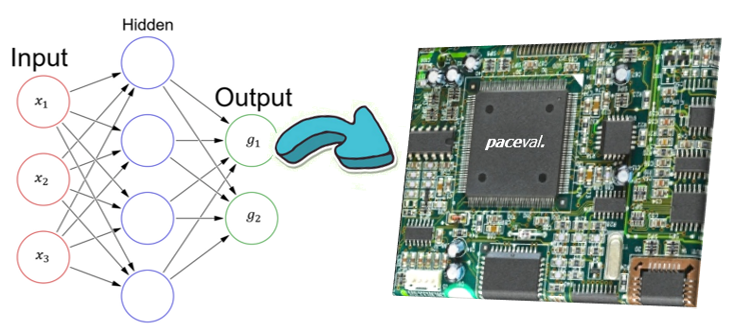

## WHY DO I NEED A MATHEMATICAL ENGINE IN HARDWARE?

“In a digital world of the future, everyday life and the working world around us will be permanently supported by artificial intelligence. Data from countless sensors and actuators are read out by the smallest computers, processed, merged via a network of data links into larger nodes with more computing power, interpreted, fed back. They change, control, support, move our lives. In between sit huge data centers that take on the big tasks, manage and direct data, train artificial brains and solve complex scientific problems.

But this vision of a connected world currently comes at a high price. If global energy consumption for computing and communications increases at the same rate as it has been, it will take up the entire, global capacity for energy production as early as 2040. Energy consumption has been falling for a long time - because chip structures have become smaller and smaller. But this is where developments are now reaching their physical limits.

In order to implement our visions for the future - from autonomous driving to computer-aided drug development to intelligent control of countless renewable energy sources - fundamentally new computing concepts must therefore be found.”

Source: <https://www.sprind.org/en/challenges/newcomputing/>

## OUR TECHNOLOGY

Using new and existing technologies, a first reference design was developed that maps **pace***val.* in hardware with the required functionalities. **This reference design is hardware based on a programmable System-on-a-Chip (SoC)** from the AMD Xilinx Zync 7000 platform. The possible certification and subsequent official approval of an end product on this hardware should not be a problem, since the SoC already meets the high requirements of the automotive industry AEC-Q100.

The basic operating system on the SoC is PetaLinux as a so-called "Embedded Linux Distribution", as offered by Xilinx. Our application within PetaLinux is the paceval-service. This is set up to respond to HTTP requests on port 8080. The API provided by this service allows for the efficient evaluation of closed mathematical functions of any length and any number of variables. This allows all financial, stochastic, technical and scientific functions and in particular all machine learning models to be executed. In addition, the usual standard mathematical notation can be used. Since the mathematical functions are available entirely in text form, there is a way to certify and then officially approve the software. In conjunction with the approval of the hardware, this results in an approved overall system, which is not possible per se for products based on neural networks today.

The chosen interface to communicate with our reference design is Ethernet. Of course, this can be changed as the SOC offers PCI Express, USB, Ethernet, SPI, SD/SDIO, I2C, CAN, UART and GPIO for communication in its entirety (the Xilinx ZC706 below). The selected software solution could also be easily transferred to a significantly more powerful multiprocessor system-on-a-chip (MPSoC) like the Xilinx ZYNC UltraSCALE+ platform (the Xilinx ZCU104 below). This not only enables small, energy-saving IoT and IIoT variants (the Digilent Arty Z7-20 below), but also large variants for data centers and in particular the well-known hyperscalers such as Amazon Web Services (AWS), Microsoft Azure and the Google Cloud Platform.

## HOW CAN I SET UP A MATHEMATICAL ENGINE WITH MY OWN FPGA?

We are currently using the Zync-7000 platform from AMD Xilinx for our development of **pace***val.* in hardware with these three developer boards:

-   Digilent Arty Z7-20, <https://digilent.com/reference/programmable-logic/arty-z7/reference-manual>
-   Xilinx ZC706, <https://www.xilinx.com/publications/prod_mktg/Zynq_ZC706_Prod_Brief.pdf>
-   Xilinx ZCU104, <https://www.xilinx.com/products/boards-and-kits/zcu104.html>

These boards have been selected by us based on customers' specific needs for mathematical efficiency versus total hardware cost (such as bill of materials) and integration. The Digilent Arty Z7-20 makes sense for small and medium-sized mathematical functions, the Xilinx ZC706 for medium-sized and large mathematical functions and the Xilinx ZCU104 for large to very large mathematical functions and data centers (e.g. hyperscalers).

Since the paceval-service itself running on the SOC only requires ARM32 or ARM64 support and no other specific requirements, the following description can also be applied to any other AMD Xilinx Zync-7000 platform development board.

Note: Currently, the paceval-service is implemented purely in software on the processing system (e.g. PetaLinux) and does not yet use the functions of the FPGA. We will use this GitHub to implement the FPGA functionalities in a timely manner.

This means that you can expect a lot more in the future in the following areas:

-   Speed
-   Efficiency (especially mathematics per watt)

However, the current values already look very promising (especially when you compare these values with those of a GPU that consumes a hundred times more power):

**Digilent Arty Z7-20 total On-Chip Power: 1.5 Watt**


**Xilinx ZC706 total On-Chip Power: 1.8 Watt**  


**Xilinx ZCU104 total On-Chip Power: 3.4 Watt**

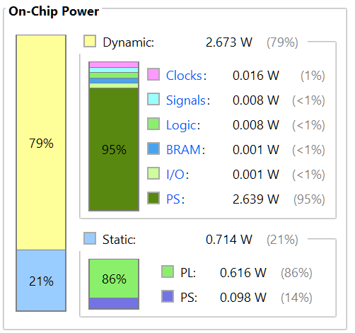

# Easy Setup paceval-engine

We provide images for SD cards for the following developer boards on our GitHub. You can use these images immediately to easily set up a paceval-engine in hardware:

**Digilent Arty Z7-20**

https://github.com/paceval/paceval/tree/main/paceval%20in%20hardware/Digilent%20Arty%20Z7-20 File “32GB_sdimage_ArtyZ7-20_paceval-engine_petalinux.zip”

**Xilinx ZC706**

https://github.com/paceval/paceval/tree/main/paceval%20in%20hardware/Xilinx%20ZC706 File “32GB_sdimage_ZC706_paceval-engine_petalinux.zip”

**Xilinx ZCU104**

https://github.com/paceval/paceval/tree/main/paceval%20in%20hardware/Xilinx%20ZCU104 File “64GB_sdimage_ZCU104_paceval-engine_petalinux.zip”

If you want to access Linux on the hardware,  
the username is: **paceval**  
and the password is: **paceval**

**Please note:** These images were created with **pace***val.* version 4.04. The version 4.04 libraries in the images have already expired. **To solve this, however, you simply need to copy the current paceval libraries for ARM 32bit and ARM 64bit into the /home/paceval/sambashare directory on your hardware. And if you want, the appropriate examples too.**

All currently valid and executable libraries and examples can be found in our current **pace***val.* SDK on our homepage <https://paceval.com> and also on our paceval Github in these directories  
<https://github.com/paceval/paceval/tree/main/paceval%20libraries>  
<https://github.com/paceval/paceval/tree/main/demo%20and%20examples>

# Alternative Manual Setup

The following sections show how to manually set up a paceval-engine initially. This may be necessary if the SD card images that we provide do not meet your requirements. This can be the case, for example, if your hardware configuration is different or you need other software packages.

The following **description refers to the Digilent Arty Z7-20**, which is popular with makers, but which can easily be used for any other board with an SD card.


**Prerequisites:**

-   Vivado 2022.2 (or later) installed on Linux (and if necessary also on Windows)
-   PetaLinux installed on Linux

You can use alternatives for these programs:

-   Win32 Disk Imager installed on Windows
-   Paragon Partition Manager (e.g. Free version) installed on Windows
-   Tera Term installed on Windows

To boot from the SD card with the Digilent Arty Z7-20, jumper JP4 must be switched to SD as shown in the picture. This tells the ZYNC to look for bootloaders, kernel, filesystem, etc. on the SD card:

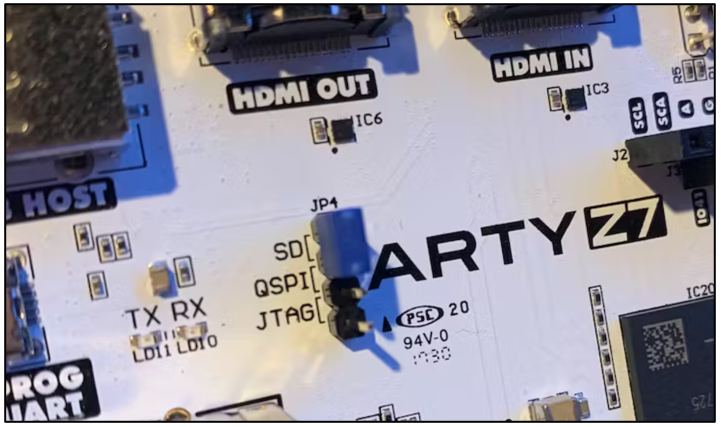

**A notice**

For the **Xilinx ZC706** please set the jumpers as follows:

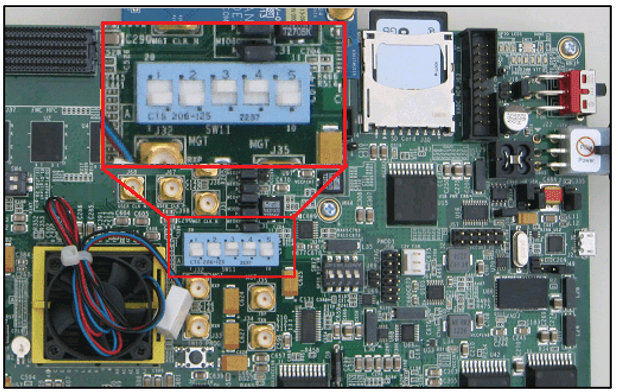

For the **Xilinx ZCU104** please set the jumpers as follows:  
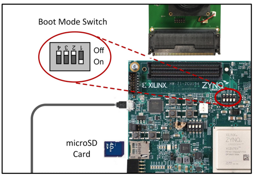

## Step 0 - Hardware Design

If you already have a hardware design, you can skip this step.

First you have to create a simple hardware design for the Digilent Arty Z7-20 under Vivago. This video is certainly useful for beginners:

https://www.youtube.com/watch?v=i89v9T8Hdi0

Then export the hardware including the bitstream in Vivado.

**A notice**

We have put simple hardware designs for the Digilent Arty Z7-20, the Xilinx ZC706 and the Xilinx ZCU104 on our GitHub:

-   Digilent Arty Z7-20  
    https://github.com/paceval/paceval/tree/main/paceval%20in%20hardware/Digilent%20Arty%20Z7-20/manual%20setup File “Vivado 2022.2 project-Digilent Arty Z7-20.zip”
-   Xilinx ZC706  
    https://github.com/paceval/paceval/tree/main/paceval%20in%20hardware/Xilinx%20ZC706/manual%20setup File “Vivado 2022.2 project-Xilinx ZC706.zip”
-   Xilinx ZCU104  
    https://github.com/paceval/paceval/tree/main/paceval%20in%20hardware/Xilinx%20ZCU104/manual%20setup File “Vivado 2022.2 project-Xilinx ZCU104.zip”

## Step 1 - Create the PetaLinux Project

You may have to adapt the project name, the options and the paths to your configuration for the following explanations and commands.

Enter the required commands for handling PetaLinux on Linux:

```
cd ~/petalinux/2022.2/
```

and

```
source settings.sh
```

Now we switch to our project directory

```
cd ~/petalinux/2022.2/projects/
```

and then we create the project:

```
petalinux-create --type project --template zynq --name xilinx-artyz720-2022.2 –force
```

Then we switch to the newly created project directory:

```
cd xilinx-artyz720-2022.2/
```

We copy our complete hardware design to a suitable directory under our project directory. In our case to  
\~/petalinux/2022.2/projects/xilinx-artyz720-2022.2/engine-202202

Then we configure the project with our copied hardware design:

```
petalinux-config --get-hw-description ./engine-202202/design_system_wrapper.xsa
```

This opens the user interface dialog for the configuration, where we will not make any changes for the time being.

**A notice**

For the Xilinx ZCU104, the MACHINE_NAME must be set to "zcu104_revc" in the user interface dialog:


Then we create the PetaLinux for our development board:

```
petalinux-build
```

This will take time. Once the PetaLinux creation is complete, we create the required files for the SD card

```
petalinux-package --force --boot --fsbl ./images/linux/zynq_fsbl.elf --fpga ./images/linux/system.bit --u-boot
```

and then create the image for the SD card:

```
petalinux-package --wic
```

We copy the generated image "petalinux-sdimage.wic" for the SD card from the directory "\~/petalinux/2022.2/projects/xilinx-artyz720-2022.2/images/linux/" to Windows.

Then we write the file "petalinux-sdimage.wic" to the SD card with the Win32 Disk Imager. In our case the SD card is in drive E:\\

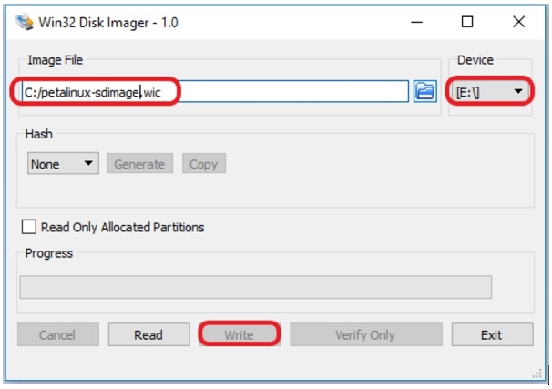

Finally, we start the Paragon Partition Manager and increase the Linux root to the full free size of the SD card. This is necessary so that PetaLinux and our applications still have space to write on it. Ignore any warnings about increasing the Linux root.

Before:


After:


Install the SD card into its slot (J9) on the bottom side of the Digilent Arty Z7-20 board:

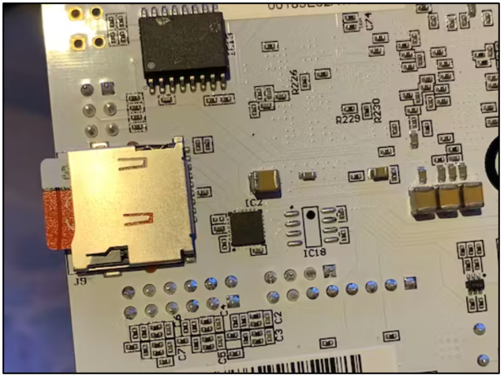

Plug a micro USB cable to the JTAG/UART USB host port J14 of the Digilent Arty Z7-20 board:

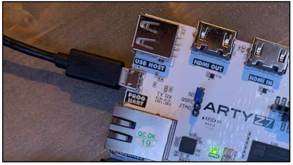

Open your serial terminal application of choice (e.g. Tera Term) with a baud rate setting of 115200:

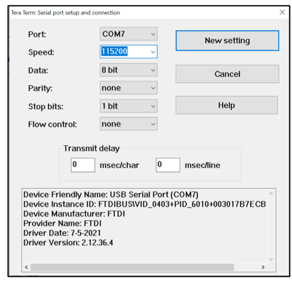

And then you can watch the boot process.  
Up to here everything should have worked successfully and you can now configure the paceval-engine.

## Step 2 - Configure the paceval-engine

Now we configure the development board for paceval. In this way we get an engine that runs on the hardware and call it "paceval-engine" accordingly. To do this, we enter the following command, which opens a user interface dialog:

```
petalinux-config -c rootfs
```

We set “paceval” as the user name and we also set “paceval” as the password. We also add the user "paceval" as a sudo user.

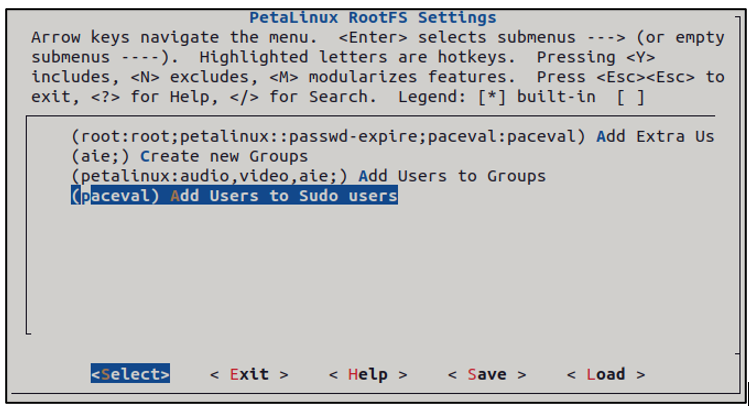

Then we check whether

-   ssh-server-dropbear
-   hwcodecs
-   as Init-manager sysvinit

are set.


For „Filessystem Packages/base“ we set

-   util-linux
-   util-linux-swaponoff

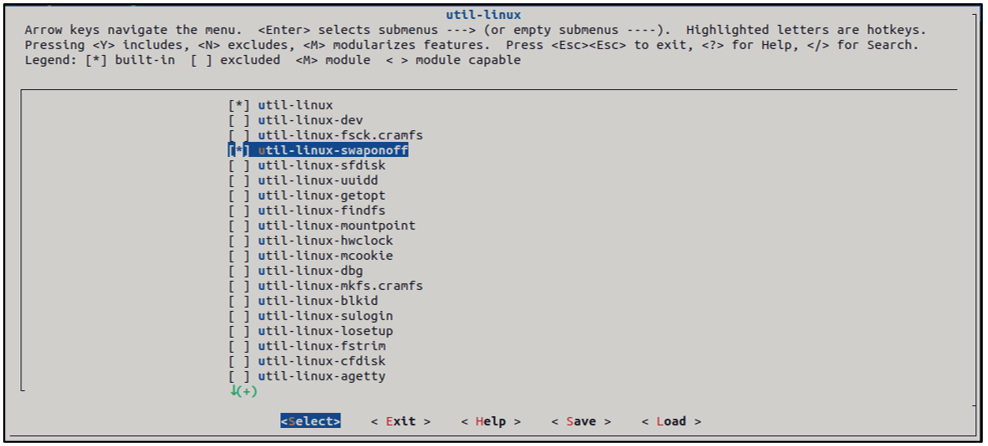

For „Filessystem Packages/network“ we set

-   ntp

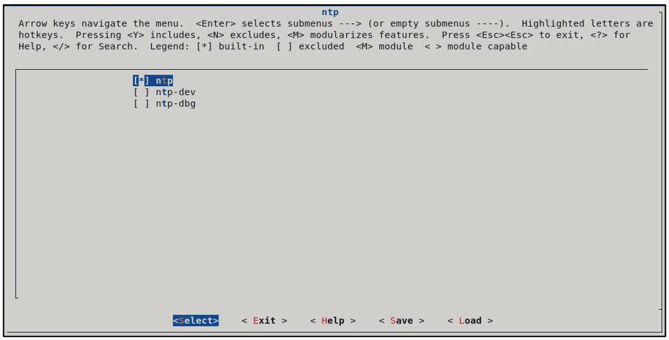

For „Filessystem Packages/base“ we set

-   busybox
-   busybox-hwclock

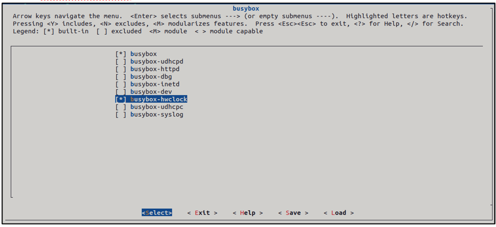

We now leave the settings via "Exit" and accept the configuration when the dialog appears with "Yes":  


To check if everything worked, create the PetaLinux for our development board:

```
petalinux-build
```

Here, too, we create the required files for the SD card as a test

```
petalinux-package --force --boot --fsbl ./images/linux/zynq_fsbl.elf --fpga ./images/linux/system.bit --u-boot
```

and then create the image for the SD card:

```
petalinux-package --wic
```

But we will not write the image to the SD card yet.

## Step 3 – Add required user packages for the paceval-engine

We open the "user-rootfsconfig" file that defines the required user packages:

```
sudo nano ~/petalinux/2022.2/projects/xilinx-artyz720-2022.2/project-spec/meta-user/conf/user-rootfsconfig
```

Then we add the following lines to the "user-rootfsconfig" file for our required user packages:

```
#Note: Mention Each package in individual line
#These packages will get added into rootfs menu entry

CONFIG_nodejs
CONFIG_nodejs-npm
CONFIG_samba
CONFIG_nano
CONFIG_mc
CONFIG_php
CONFIG_php-cli
CONFIG_php-cgi
CONFIG_lighttpd
CONFIG_curl
CONFIG_inetutils-inetd
CONFIG_unzip
CONFIG_lighttpd-module-fastcgi
CONFIG_php-fpm
CONFIG_ntp
CONFIG_ntpdate
CONFIG_packagegroup-core-buildessential
```


With CTRL-X and then SHIFT-Y to save we exit the editor.

Now we activate all previously defined user packages. For this we call this command

```
petalinux-config -c rootfs
```

and we select all our required user packages:  
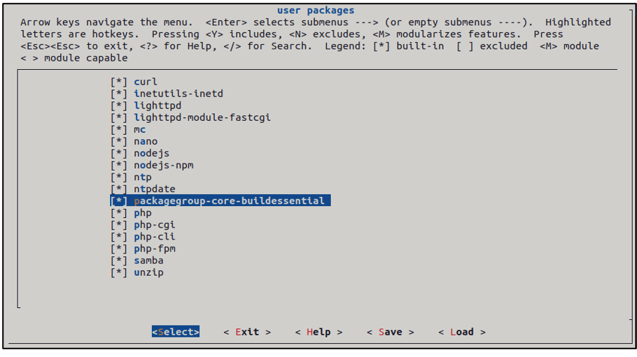

We now leave the settings again via "Exit" and accept the configuration when the dialog appears with "Yes":  


Since the following build process requires a lot of disk space, please make sure that at least 50 gigabytes are free. These are not all needed, but to be sure...

The build process will also take a long time this time. So now it would be time for an extended lunch or dinner over several hours :) - in addition, many "warnings" are displayed during the build process - these can be ignored.

To double check that everything worked, build the PetaLinux for our development board:

```
petalinux-build
```

Here, too, we create the required files for the SD card again as a test

```
petalinux-package --force --boot --fsbl ./images/linux/zynq_fsbl.elf --fpga ./images/linux/system.bit --u-boot
```

and then create the image for the SD card:

```
petalinux-package --wic
```

However, we will not write the image to the SD card just yet.

## Step 4 – Final configuration of the paceval-engine

We now finally configure the PetaLinux for the paceval-engine. To do this, we first call this command:

```
petalinux-config
```

In the user interface dialog we set the host name and product name to "paceval-engine" under "Firmware Version Configuration". If you have several developer boards, it is advisable to assign different host names.

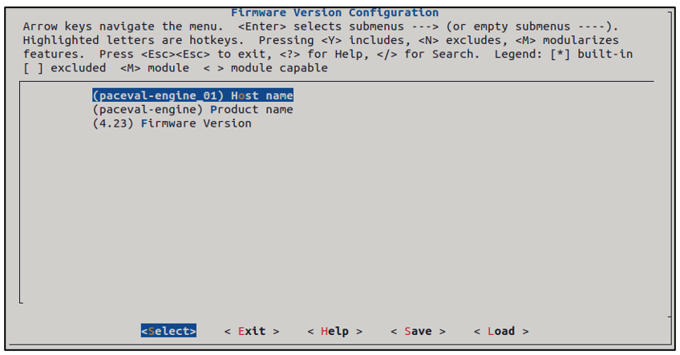

In addition, we always set random MAC addresses in the "Ethernet settings":  
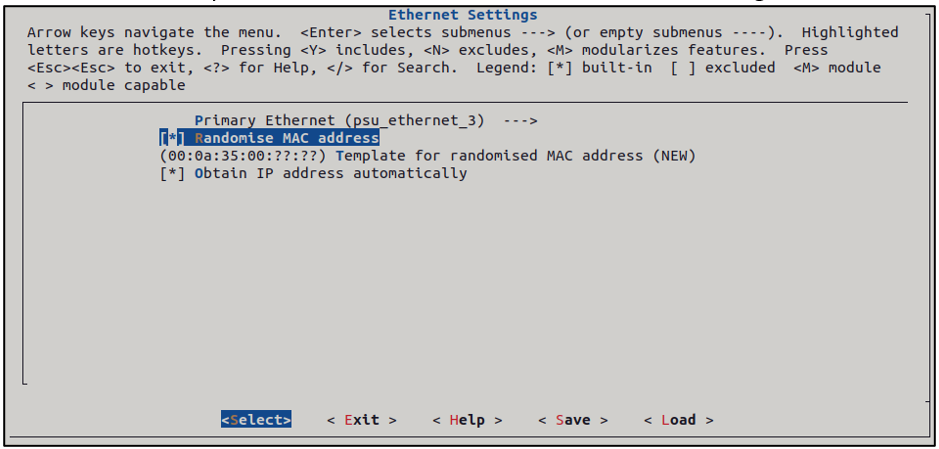

We now leave the settings again via "Exit" and accept the configuration when the dialog appears with "Yes":  


Then we create the app for our bootscripts that we need with

```
petalinux-create -t apps --template install -n bootscript --enable
```

and

```
petalinux-build -c bootscript -x do_install -f
```

We check with

```
petalinux-config -c rootfs
```

whether "bootscript" is now available in the apps and activate it if necessary:


We leave the settings again via "Exit" and accept the configuration if the dialog appears with "Yes":  


Then we edit the "bootscript.bb" file for our start files or initial configuration of the paceval-engine:

```
sudo nano ~/petalinux/2022.2/projects/xilinx-artyz720-2022.2/project-spec/meta-user/recipes-apps/bootscript/bootscript.bb
```

We delete the text from the "bootscript.bb" file and paste the following:

```
#
# This file is the bootscript recipe.
#

SUMMARY = "Simple bootscript application"
SECTION = "PETALINUX/apps"
LICENSE = "MIT"
LIC_FILES_CHKSUM = "file://${COMMON_LICENSE_DIR}/MIT;md5=0835ade698e0bcf8506ecda2f7b4f302"

SRC_URI = "file://bootscript \
           file://bootscript_done \
           file://smb.conf \
           file://paceval-service_Linux_arm32_arm64.conf \ 
           file://paceval-examples_Linux_arm32.conf \ 
           file://paceval-examples_Linux_arm64.conf \
           file://lighttpd.conf \ 
           file://php.ini \ 
           file://www_content.conf \ 
	"

S = "${WORKDIR}"

inherit update-rc.d

INITSCRIPT_NAME = "bootscript"
#INITSCRIPT_PARAMS = "start 99 S ."
do_install() {
	     install -d ${D}${sysconfdir}/init.d
	     install -m 0755 ${S}/bootscript ${D}/${sysconfdir}/init.d
	     
	     install -d ${D}${sysconfdir}/paceval-bootscript-files
	     install -m 0755 ${S}/bootscript_done ${D}/${sysconfdir}/paceval-bootscript-files	 
	
	     install -d ${D}${sysconfdir}/paceval-bootscript-files
	     install -m 0755 ${S}/smb.conf ${D}/${sysconfdir}/paceval-bootscript-files	
	     
	     install -d ${D}${sysconfdir}/paceval-bootscript-files
	     install -m 0755 ${S}/paceval-service_Linux_arm32_arm64.conf ${D}/${sysconfdir}/paceval-bootscript-files
	     
	     install -d ${D}${sysconfdir}/paceval-bootscript-files
	     install -m 0755 ${S}/paceval-examples_Linux_arm32.conf 
	     install -m 0755 ${S}/paceval-examples_Linux_arm64.conf ${D}/${sysconfdir}/paceval-bootscript-files
	     
	     install -d ${D}${sysconfdir}/paceval-bootscript-files
	     install -m 0755 ${S}/lighttpd.conf ${D}/${sysconfdir}/paceval-bootscript-files
	     
	     install -d ${D}${sysconfdir}/paceval-bootscript-files
	     install -m 0755 ${S}/php.ini ${D}/${sysconfdir}/paceval-bootscript-files	   
	     
	     install -d ${D}${sysconfdir}/paceval-bootscript-files
	     install -m 0755 ${S}/www_content.conf ${D}/${sysconfdir}/paceval-bootscript-files	  
}
FILES_${PN} += "${sysconfdir}/*"
```

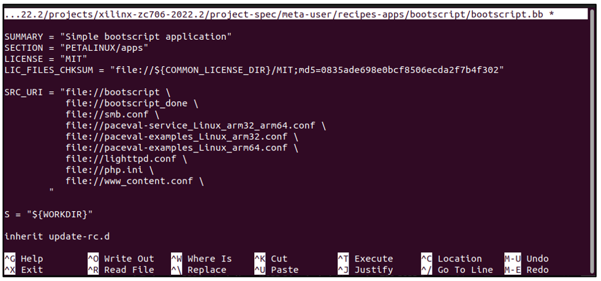

With CTRL-X and then SHIFT-Y to save we exit the editor.

You now need to download the compressed folder “recipes-apps_bootscript_files.zip” from our GitHub:

<https://github.com/paceval/paceval/tree/main/paceval%20in%20hardware/Digilent%20Arty%20Z7-20/manual%20setup> File “recipes-apps_bootscript_files.zip”

You must then unzip this compressed folder “recipes-apps_bootscript_files.zip” in the following folder:

\~/petalinux/2022.2/projects/xilinx-artyz720-2022.2/project-spec/meta-user/recipes-apps/bootscript/files/

The previously existing default “bootscript” file will also be overwritten.

The folder should then look like this (the sizes of the files themselves may be different):


Then for one last time, build PetaLinux for our development board:

```
petalinux-build
```

We create the required files for the SD card

```
petalinux-package --force --boot --fsbl ./images/linux/zynq_fsbl.elf --fpga ./images/linux/system.bit --u-boot
```

and then create the image for the SD card:

```
petalinux-package --wic
```

Then, as described above, we write the SD card image "petalinux-image.wic" to the SD card. We enlarge the Linux root partition to the maximum. Connect the LAN cable with Internet to the Ethernet port. Then we boot the development board with the inserted SD card. Finally, you can observe the boot process in your serial terminal application.

At the very first start, all required files are unpacked and installations are also downloaded from the Internet. Then you can log in with the user name "paceval" and the password "paceval".

Congratulations! You have now **successfully installed the paceval-engine in hardware manually**.

Copyright © 2015-2023 paceval.® All rights reserved.  
<mailto:info@paceval.com>
