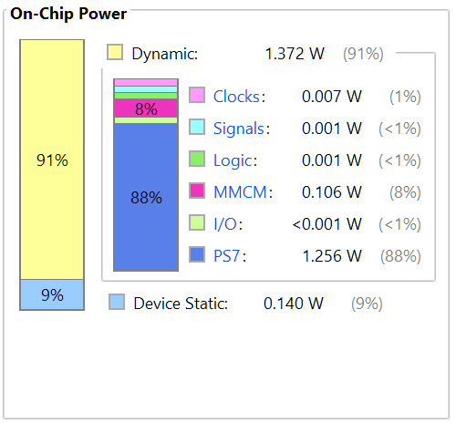

# paceval in hardware - the Mathematical Engine as a Service with an FPGA (e.g. for efficient Artificial Intelligence inference or fast Zero-Knowledge-Proofs)

paceval in hardware GitHub - https://github.com/paceval/paceval/tree/main/paceval%20in%20hardware

paceval at SwaggerHub -

https://app.swaggerhub.com/apis-docs/paceval/paceval-service/4.23

WHY DO I NEED A MATHEMATICAL ENGINE IN HARDWARE?

“In a digital world of the future, everyday life and the working world around us will be permanently supported by artificial intelligence. Data from countless sensors and actuators are read out by the smallest computers, processed, merged via a network of data links into larger nodes with more computing power, interpreted, fed back. They change, control, support, move our lives. In between sit huge data centers that take on the big tasks, manage and direct data, train artificial brains and solve complex scientific problems.

But this vision of a connected world currently comes at a high price. If global energy consumption for computing and communications increases at the same rate as it has been, it will take up the entire, global capacity for energy production as early as 2040. Energy consumption has been falling for a long time - because chip structures have become smaller and smaller. But this is where developments are now reaching their physical limits.

In order to implement our visions for the future - from autonomous driving to computer-aided drug development to intelligent control of countless renewable energy sources - fundamentally new computing concepts must therefore be found.”

Source: <https://www.sprind.org/en/challenges/newcomputing/>

OUR TECHNOLOGY

Using new and existing technologies, an initial reference design was developed that maps **pace***val.* in hardware from the required functionalities. This reference design is based in hardware on a programmable System-on-a-Chip (SoC) of the Zync-7000 platform from AMD Xilinx. The possible certification and subsequent regulatory approval of a final product on this hardware should be unproblematic, since the SoC already meets the tough requirements of the automotive industry AEC-Q100.

The basic operating system on the SoC is PetaLinux as a so-called "embedded Linux distribution" as supported by Xilinx. As an application within PetaLinux, the our paceval-service is set up to respond to http requests on port 8080. The API provided by this service allows closed-form mathematical functions of arbitrary length and with arbitrary number of variables to be effectively evaluated. This can be used to represent all financial, stochastic, engineering and scientific functions, and in particular all machine learning models. In addition, the usual standard mathematical notation can be used. Since the mathematical functions are available entirely in textual form, there thus exists a path to certification and subsequent regulatory approval of the software. This, in conjunction with the approval of the hardware, results in an approved overall system, which is not possible per se today for products based on neural networks.

The chosen interface for communication with our reference design is Ethernet. The SoC offers PCI Express, USB, Ethernet, SPI, SD/SDIO, I2C, CAN, UART and GPIO for communication. The chosen software solution could also be easily transferred to a much more powerful multiprocessor system-on-a-chip (MPSoC). This not only enables small, energy-saving IoT and IIoT variants, but also large variants for data centers and, in particular, the well-known hyperscalers such as Amazon Web Services (AWS), Microsoft Azure and the Google Cloud Platform.

HOW CAN I SET UP A MATHEMATICAL ENGINE WITH MY OWN FPGA?

We are currently using the Zync-7000 platform from AMD Xilinx for our development **pace***val.* in hardware with these three developer boards:

-   Digilent Arty Z7-20, <https://digilent.com/reference/programmable-logic/arty-z7/reference-manual>
-   Xilinx ZC706, <https://www.xilinx.com/publications/prod_mktg/Zynq_ZC706_Prod_Brief.pdf>
-   Xilinx ZCU104, <https://www.xilinx.com/products/boards-and-kits/zcu104.html>

These developer boards are chosen by us according to the needed functionality and expected functionality based on the cost of the board itself and the efficiency of the math. For small and medium mathematical functions the Digilent Arty Z7-20 makes sense, for medium and large mathematical functions the Xilinx ZC706 and for large to very large mathematical functions the Xilinx ZCU104.

Since the paceval-service only requires ARM32 and ARM64 and there are no other specific requirements, the following description can also be applied to any other developer board of the AMD Xilinx Zync-7000 platform.

Note: Currently the paceval service is implemented purely in software on the processing system, i.e., PetaLinux and does not yet use the FPGA. We will use this GitHub to implement the FPGA functionalities in a timely manner.

I.e., you can expect a lot more in the future regarding the following points:

-   Speed
-   Efficiency (especially mathematics per watt)

However, the current values already look very promising:

Digilent Arty Z7-20 total On-Chip Power: 1.5 Watt

Xilinx ZC706 total On-Chip Power: 1.8 Watt  

Xilinx ZCU104 total On-Chip Power: 3.4 Watt

# Setup

The following description refers to the Digilent Arty Z7-20, but can also be used for any other board with an SD card.

To be continued ...

Copyright © 2015-2023 paceval.® All rights reserved.  
<mailto:info@paceval.com>
