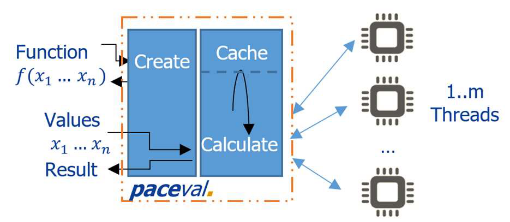
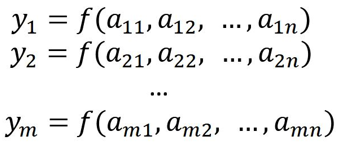
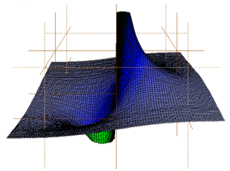
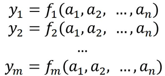
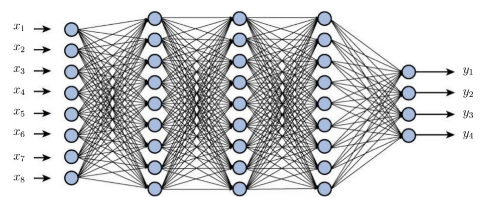
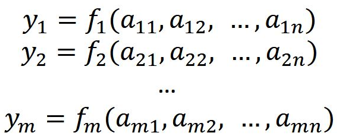

# paceval. the system independent mathematical engine 4.25

Documentation of the paceval. source-code, Copyright ©1994-2024. Version 1.x, 2.x, 3.x, 4.x ©1994-2024 Joerg Koenning & paceval.[Registered Trade Mark]  
All rights reserved., Author(s) : Joerg Koenning

External documentation -

<https://paceval.com/paceval_sources_documentation-external/html/index.html>

## What is paceval.?

**paceval is a mathematical engine** that can calculate almost any complex mathematical expressions. The software reads a textual description of the expressions as a mathematical function, which may contain the basic arithmetic operations, the usual transcendental functions (trigonometry, exponential function, etc.) and other common operations.

Expressions can contain **any number of placeholders (variables)**. Calculations are performed in selectable precision (single, double and extended) and **distributed across all available processors** for maximum speed and effectiveness.

Additionally, paceval can also output an interval indicating the error limits due to the limited precision of floating point number formats.

## How does paceval work internally?

paceval internally **creates and processes linked lists of atomic calculations** that represent the user's mathematical expressions. The usual approach is to create an expression tree from a text expression, see <https://en.wikipedia.org/wiki/Binary_expression_tree>. This has the well-known disadvantages such as memory consumption and the overhead and speed loss when creating and traversing the expression tree. Creating and processing an expression as a linked list offers many advantages over the usual approach, especially speed. The processing of the linked list when actually performing a calculation with values for the variables is done in a single C function that is called by each thread of the underlying system.

paceval uses multithreading intensively to achieve maximum performance and energy efficiency of the respective hardware system. The main handling of multithreading in paceval in software is in the file [paceval_fThreadHandling.cpp](https://paceval.com/paceval_sources_documentation-external/html/paceval__f_thread_handling_8cpp.html). paceval can also be used as a hardware driver for a new type of energy-efficient coprocessor. To do this, only the handling in the file [paceval_fFPGAHandling.cpp](https://paceval.com/paceval_sources_documentation-external/html/paceval__f_f_p_g_a_handling_8cpp.html) has to be adapted to address the customer-specific hardware such as an FPGA.

The source code performs this processing (this corresponds to the standard cycle used by all types of processors):

1.  **FETCH** - Get the operator and operands (e.g. "addition of 2 and 3")
2.  **DECODE** and **DECIDE** - Use the cached result from the cache or call the next step EXECUTE
3.  **EXECUTE** - Execute the operator with the operands (e.g. call the C function to add 2 and 3 and get 5 as a result)
4.  **WRITE BACK** - Cache the result of the atomic calculation (this includes lower and upper interval limits or errors)

## “Create” and “Calculate”

Essentially **only two steps are necessary to perform calculations**. A computation object is first created ("Create" step) by the user passing a function and the set of variable identifiers. Concrete calculations can then be carried out again and again ("Calculate" step) with the object that has been created by the user passing the values for the variables.

In the **"Create" step**, a list of the individual atomic calculation rules is created with the computation object and aligned for maximum parallelizability. The user receives back a unique ID or "token" for the created object. Any number of computation objects can be created. In addition, there is no limit to the length of the function and the number of variables.

In the **"Calculate" step**, the calculation is carried out using the values for the variables. The list of individual atomic calculation rules is **distributed as partial sequences across all available processors or threads in the system** in order to achieve maximum speed. In addition, complex calculations of partial sequences that have been carried out once are **temporarily stored as a cache** so that they do not have to be calculated again if necessary.

## Mathematical functions

All mathematical functions can be calculated and combined with logical operators. This allows **all financial, stochastic, engineering and scientific functions and also all models for machine learning** to be represented. In addition, the usual standard mathematical notation can easily be used.

The following operators, partial functions and symbols are currently supported:

-   **Basic arithmetic operations** +, -, \*, /
-   **Logical operators** NOT, AND, OR, XOR, NAND, XNOR
-   **Comparison operators** \<, \>, =, \>=, \<=, \<\>
-   **Factorial** !, fac()
-   **Constants** pi, e
-   **Brackets** ()
-   **Power/root functions** \^, sqr(), sqrt(), exp()
-   **Logarithm functions and sigmoid function** lg(), ln(), sig()
-   **Trigonometric functions and associated inverses** sin(), cos(), tan(), cot(), asin(), acos(), atan(), acot()
-   **Hyperbolic functions and associated inverses** sinh(), cosh(), tanh(), coth(), arsinh(), arcosh(), artanh(), arcoth()
-   **Numerical manipulations** sgn(), abs(), round(), ceil(), floor(), rand()
-   **paceval specific numerical manipulations** ispos(), isposq(), isneg(), isnegq(), isnull()
-   **Minimum and maximum** min, max
-   **Modulo symmetric and mathematical variant** %, mod

## The list of the main API

-   [paceval_CreateComputation()](https://paceval.com/paceval_sources_documentation-external/html/paceval__main_8cpp.html#ae04cf0ab1cdbd57df334d660578bfdc3) : Creates a computation object for the mathematical function f and the variables x1,x2,...,xn, i.e. in mathematical notation  
      
    The user can also set whether calculations should be carried out with or without interval arithmetic. The reference returned when calling CreateComputation is an ID or "token" that uniquely represents the created calculation object, which is managed by paceval. This token can then be used to carry out calculations and queries on the calculation object without having to retransmit the possibly very long function again.
-   [paceval_dGetComputationResult()](https://paceval.com/paceval_sources_documentation-external/html/paceval__main_8cpp.html#acbc57bb0edcafb8811d082617b6b1531) [paceval_ldGetComputationResult(), [paceval_fGetComputationResult()](https://paceval.com/paceval_sources_documentation-external/html/paceval__main_8cpp.html#a608786d2771854226f6326ebd9c9c0ab)] : Performs a calculation on a computation object with the variables declared by [paceval_CreateComputation()](https://paceval.com/paceval_sources_documentation-external/html/paceval__main_8cpp.html#ae04cf0ab1cdbd57df334d660578bfdc3) and with a set of values a1,a2,...,an for these variables, i.e. in mathematical notation  
    
-   [paceval_dGetComputationResultExt()](https://paceval.com/paceval_sources_documentation-external/html/paceval__main_8cpp.html#a355e632ee48694f62cf038b77b6ca6ac) [paceval_ldGetComputationResultExt(), [paceval_fGetComputationResultExt()](https://paceval.com/paceval_sources_documentation-external/html/paceval__main_8cpp.html#ac0f2e206cb7c87cffa8bb334ee2832d1)] : Performs multiple calculations in parallel on a computation object with the variables declared by [paceval_CreateComputation()](https://paceval.com/paceval_sources_documentation-external/html/paceval__main_8cpp.html#ae04cf0ab1cdbd57df334d660578bfdc3) and with multiple sets of values a11,a12,...,a1n, a21,a22,...,a2n, ..., am1,am2,...,amn for these variables, i.e. in mathematical notation  
      
    (Annotation: [paceval_dGetComputationResultExt()](https://paceval.com/paceval_sources_documentation-external/html/paceval__main_8cpp.html#a355e632ee48694f62cf038b77b6ca6ac) should be used to get many results at once with a single call. This is useful, for example, when many different values need to be analyzed very quickly or when you plot 2D- or 3D-functions and graphics very fast.)  
    
-   [paceval_dGetMultipleComputationsResults()](https://paceval.com/paceval_sources_documentation-external/html/paceval__main_8cpp.html#a7ee63b91471db048e4e8c7c9940a0b14) [paceval_ldGetMultipleComputationsResults(), [paceval_fGetMultipleComputationsResults()](https://paceval.com/paceval_sources_documentation-external/html/paceval__main_8cpp.html#ad33a118f90a1313031e7724839c6c025)] : Performs multiple calculations in parallel on multiple computation objects with the variables declared by [paceval_CreateComputation()](https://paceval.com/paceval_sources_documentation-external/html/paceval__main_8cpp.html#ae04cf0ab1cdbd57df334d660578bfdc3) and with the same set of values a1,a2,...,an for these variables, i.e. in mathematical notation  
      
    (Annotation: [paceval_dGetMultipleComputationsResults()](https://paceval.com/paceval_sources_documentation-external/html/paceval__main_8cpp.html#a7ee63b91471db048e4e8c7c9940a0b14) should be used to obtain results for several computation objects at the same time, e.g. for artificial neural network functions or decision trees, in which several functions with the same variable values are calculated in one step in order to decide on an object.)

    

-   [paceval_dGetMultipleComputationsResultsExt()](https://paceval.com/paceval_sources_documentation-external/html/paceval__main_8cpp.html#a5cc7887ed6b733722bd93a7669cf7a34) [paceval_ldGetMultipleComputationsResultsExt(), [paceval_fGetMultipleComputationsResultsExt()](https://paceval.com/paceval_sources_documentation-external/html/paceval__main_8cpp.html#ad459ea225b88689869085d7995c8b0d8)] : Performs multiple calculations in parallel on multiple computation objects using the variables declared by [paceval_CreateComputation()](https://paceval.com/paceval_sources_documentation-external/html/paceval__main_8cpp.html#ae04cf0ab1cdbd57df334d660578bfdc3) and with multiple sets of values a11,a12,...,a1n, a21,a22,...,a2n, ..., am1,am2,...,amn for these variables, i.e. in mathematical notation  
      
    (Annotation: [paceval_dGetMultipleComputationsResultsExt()](https://paceval.com/paceval_sources_documentation-external/html/paceval__main_8cpp.html#a5cc7887ed6b733722bd93a7669cf7a34) should be used to obtain results for several computation objects at the same time and to carry out as many different evaluations as possible at once, e.g. for artificial neural network functions or decision trees, in which several functions with different variable values are calculated in one step in order to decide on several objects at the same time.
-   [paceval_DeleteComputation()](https://paceval.com/paceval_sources_documentation-external/html/paceval__main_8cpp.html#a0a5a920a210ff6914dd5742f096635a2) : Deletes a computation object with the given token.

Copyright © 2015-2024 paceval.® All rights reserved. mailto:info@paceval.com
